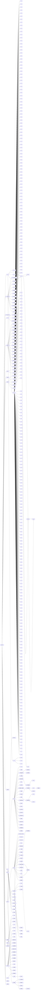

```mermaid
	graph LR;
	Algorithm --> .git
	.git --> hooks
	.git --> info
	.git --> logs
	logs --> refs
	refs --> heads
	refs --> remotes
	remotes --> origin
	.git --> objects
	objects --> 00
	objects --> 01
	objects --> 02
	objects --> 03
	objects --> 04
	objects --> 05
	objects --> 06
	objects --> 07
	objects --> 08
	objects --> 09
	objects --> 0a
	objects --> 0b
	objects --> 0c
	objects --> 0d
	objects --> 0e
	objects --> 0f
	objects --> 10
	objects --> 11
	objects --> 12
	objects --> 13
	objects --> 14
	objects --> 15
	objects --> 16
	objects --> 17
	objects --> 18
	objects --> 19
	objects --> 1a
	objects --> 1c
	objects --> 1d
	objects --> 1f
	objects --> 20
	objects --> 21
	objects --> 22
	objects --> 23
	objects --> 24
	objects --> 25
	objects --> 26
	objects --> 27
	objects --> 28
	objects --> 29
	objects --> 2a
	objects --> 2b
	objects --> 2c
	objects --> 2d
	objects --> 2e
	objects --> 30
	objects --> 31
	objects --> 32
	objects --> 33
	objects --> 34
	objects --> 35
	objects --> 36
	objects --> 37
	objects --> 38
	objects --> 39
	objects --> 3a
	objects --> 3b
	objects --> 3c
	objects --> 3d
	objects --> 3e
	objects --> 3f
	objects --> 40
	objects --> 41
	objects --> 42
	objects --> 43
	objects --> 44
	objects --> 45
	objects --> 46
	objects --> 47
	objects --> 48
	objects --> 49
	objects --> 4a
	objects --> 4b
	objects --> 4c
	objects --> 4d
	objects --> 4e
	objects --> 4f
	objects --> 50
	objects --> 52
	objects --> 53
	objects --> 54
	objects --> 55
	objects --> 56
	objects --> 57
	objects --> 58
	objects --> 59
	objects --> 5a
	objects --> 5b
	objects --> 5c
	objects --> 5d
	objects --> 5e
	objects --> 5f
	objects --> 60
	objects --> 61
	objects --> 62
	objects --> 63
	objects --> 64
	objects --> 65
	objects --> 66
	objects --> 67
	objects --> 68
	objects --> 69
	objects --> 6a
	objects --> 6d
	objects --> 6e
	objects --> 6f
	objects --> 70
	objects --> 71
	objects --> 72
	objects --> 73
	objects --> 74
	objects --> 75
	objects --> 76
	objects --> 77
	objects --> 78
	objects --> 79
	objects --> 7a
	objects --> 7b
	objects --> 7c
	objects --> 7d
	objects --> 7e
	objects --> 7f
	objects --> 80
	objects --> 81
	objects --> 82
	objects --> 83
	objects --> 84
	objects --> 85
	objects --> 86
	objects --> 87
	objects --> 88
	objects --> 89
	objects --> 8a
	objects --> 8b
	objects --> 8c
	objects --> 8e
	objects --> 90
	objects --> 91
	objects --> 92
	objects --> 93
	objects --> 94
	objects --> 95
	objects --> 96
	objects --> 97
	objects --> 98
	objects --> 99
	objects --> 9a
	objects --> 9c
	objects --> 9d
	objects --> 9e
	objects --> a0
	objects --> a1
	objects --> a2
	objects --> a3
	objects --> a4
	objects --> a5
	objects --> a6
	objects --> a7
	objects --> a8
	objects --> a9
	objects --> aa
	objects --> ab
	objects --> ac
	objects --> ad
	objects --> af
	objects --> b0
	objects --> b1
	objects --> b2
	objects --> b4
	objects --> b6
	objects --> b7
	objects --> b8
	objects --> b9
	objects --> ba
	objects --> bb
	objects --> bc
	objects --> bd
	objects --> be
	objects --> bf
	objects --> c1
	objects --> c2
	objects --> c3
	objects --> c4
	objects --> c5
	objects --> c6
	objects --> c8
	objects --> c9
	objects --> ca
	objects --> cc
	objects --> cd
	objects --> ce
	objects --> cf
	objects --> d0
	objects --> d1
	objects --> d2
	objects --> d3
	objects --> d4
	objects --> d5
	objects --> d6
	objects --> d7
	objects --> d8
	objects --> d9
	objects --> da
	objects --> db
	objects --> dc
	objects --> dd
	objects --> de
	objects --> df
	objects --> e0
	objects --> e1
	objects --> e2
	objects --> e3
	objects --> e4
	objects --> e5
	objects --> e6
	objects --> e8
	objects --> e9
	objects --> ea
	objects --> eb
	objects --> ed
	objects --> ee
	objects --> ef
	objects --> f0
	objects --> f2
	objects --> f3
	objects --> f4
	objects --> f5
	objects --> f6
	objects --> f7
	objects --> f8
	objects --> f9
	objects --> fa
	objects --> fb
	objects --> fc
	objects --> fd
	objects --> fe
	objects --> ff
	objects --> info
	objects --> pack
	.git --> refs
	refs --> heads
	refs --> remotes
	remotes --> origin
	refs --> tags
	Algorithm --> C++基础应用
	C++基础应用 --> ASCII码基础应用
	C++基础应用 --> STL
	STL --> bitset
	STL --> map
	STL --> sort
	C++基础应用 --> 位运算
	C++基础应用 --> 字符绘图
	C++基础应用 --> 年份
	C++基础应用 --> 整型的范围
	C++基础应用 --> 时钟运算
	C++基础应用 --> 标准输入输出
	C++基础应用 --> 浮点数精度
	C++基础应用 --> 矩阵旋转
	C++基础应用 --> 简单字符串处理
	C++基础应用 --> 输入加速
	C++基础应用 --> 进制
	Algorithm --> DancingLinksX
	Algorithm --> 二分
	二分 --> 二分快速幂
	二分 --> 二分枚举
	二分 --> 矩阵二分快速幂
	Algorithm --> 动态规划
	动态规划 --> 区间DP
	动态规划 --> 单调队列
	动态规划 --> 四边形不等式
	动态规划 --> 插头DP
	动态规划 --> 数位DP
	动态规划 --> 斜率优化
	动态规划 --> 最大子段
	动态规划 --> 最长单调子序列
	动态规划 --> 树形动规
	动态规划 --> 滚动数组
	动态规划 --> 滚动队列
	动态规划 --> 状态压缩
	动态规划 --> 简单动态规划
	动态规划 --> 背包问题
	动态规划 --> 记忆化搜索
	Algorithm --> 博弈
	博弈 --> SG函数
	博弈 --> 找规律
	Algorithm --> 哈希表
	Algorithm --> 字符串
	字符串 --> AC自动机
	字符串 --> KMP
	字符串 --> Manacher
	字符串 --> 后缀数组
	字符串 --> 字典树
	Algorithm --> 想法题
	Algorithm --> 数学
	数学 --> 图论
	图论 --> 2-sat
	图论 --> K短路
	图论 --> 二分图最大匹配
	二分图最大匹配 --> 最大独立集
	二分图最大匹配 --> 最小支配集
	二分图最大匹配 --> 最小顶点覆盖
	图论 --> 入度出度
	图论 --> 哈密尔顿回路
	图论 --> 奇环
	图论 --> 差分约束
	图论 --> 带权图的二分图匹配
	图论 --> 并查集
	图论 --> 拓扑排序
	图论 --> 搜索
	搜索 --> 广度优先搜索
	广度优先搜索 --> AStar
	广度优先搜索 --> BFS
	BFS --> 路径构造
	广度优先搜索 --> 双向广搜
	搜索 --> 深度优先搜索
	深度优先搜索 --> DFS
	深度优先搜索 --> IDAStar
	图论 --> 无向图割边割点
	图论 --> 最大团
	图论 --> 最大流
	图论 --> 最小树形图
	图论 --> 最小生成树
	图论 --> 最小费用最大流
	图论 --> 最短路
	图论 --> 最近公共祖先
	图论 --> 有向图判环
	图论 --> 有向图强连通
	图论 --> 欧拉回路
	数学 --> 数学公式
	数学 --> 数论
	数论 --> BabyStep_GaintStep
	数论 --> Pollard_rho
	数论 --> Rabin_Miller
	数论 --> RSA
	数论 --> 中国剩余定理
	数论 --> 二次剩余
	数论 --> 勾股定理
	数论 --> 卢卡斯定理
	数论 --> 因子枚举
	数论 --> 因式分解
	数论 --> 扩展欧几里得定理
	扩展欧几里得定理 --> 欧几里得算法
	扩展欧几里得定理 --> 线性同余
	扩展欧几里得定理 --> 逆元
	数论 --> 扩展欧拉定理
	数论 --> 整除
	数论 --> 模
	数论 --> 欧拉函数
	欧拉函数 --> 费马小定理
	数论 --> 素数筛选
	数论 --> 线性同余
	数论 --> 辗转相除
	数学 --> 组合数学
	组合数学 --> Polya
	组合数学 --> 卡特兰数
	组合数学 --> 卢卡斯定理
	组合数学 --> 容斥原理
	组合数学 --> 排列组合
	组合数学 --> 组合数
	组合数学 --> 置换群
	组合数学 --> 错排
	数学 --> 递推
	递推 --> 循环节
	数学 --> 高等数学
	高等数学 --> 三分峰值枚举
	高等数学 --> 辛普森积分
	高等数学 --> 高斯消元
	Algorithm --> 枚举
	Algorithm --> 树
	树 --> 主席树
	树 --> 大小顶堆
	树 --> 左偏树
	树 --> 平衡二叉树
	树 --> 树的直径
	树 --> 树链剖分
	树 --> 线段树
	Algorithm --> 树状数组
	Algorithm --> 模拟
	Algorithm --> 统计问题
	统计问题 --> RMQ
	统计问题 --> 优先队列
	统计问题 --> 双端队列
	统计问题 --> 栈
	统计问题 --> 部分和
	Algorithm --> 计算几何
	计算几何 --> 凸包
	计算几何 --> 半平面交
	计算几何 --> 叉乘
	计算几何 --> 圆和多边形交
	计算几何 --> 多边形面积
	计算几何 --> 多边形面积交
	计算几何 --> 最大周长三角形
	计算几何 --> 最大距离最小
	计算几何 --> 最小包围球
	计算几何 --> 最小覆盖圆
	计算几何 --> 模拟退火
	计算几何 --> 点乘
	计算几何 --> 点的旋转
	计算几何 --> 线段判交
	Algorithm --> 贪心
	贪心 --> 霍夫曼编码
	Algorithm --> 预处理
	Algorithm --> 高精度
```
