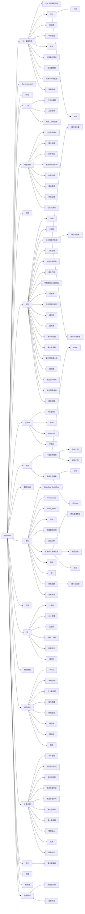

```mermaid
	graph LR;
	Algorithm --> C++基础应用
	C++基础应用 --> ASCII码基础应用
	C++基础应用 --> STL
	STL --> map
	STL --> sort
	C++基础应用 --> 位运算
	C++基础应用 --> 字符绘图
	C++基础应用 --> 年份
	C++基础应用 --> 标准输入输出
	C++基础应用 --> 浮点数精度
	C++基础应用 --> 简单字符串处理
	C++基础应用 --> 进制转换
	Algorithm --> DancingLinksX
	Algorithm --> RMQ
	Algorithm --> 二分
	二分 --> 二分快速幂
	二分 --> 二分枚举
	二分 --> 矩阵二分快速幂
	Algorithm --> 动态规划
	动态规划 --> 四边形不等式
	动态规划 --> 插头动规
	动态规划 --> 斜率优化
	动态规划 --> 最长单调子序列
	动态规划 --> 树形动规
	动态规划 --> 滚动数组
	动态规划 --> 状态压缩
	动态规划 --> 记忆化搜索
	Algorithm --> 博弈
	Algorithm --> 图论
	图论 --> 2-sat
	图论 --> K短路
	图论 --> 二分图最大匹配
	二分图最大匹配 --> 最大独立集
	二分图最大匹配 --> 最小支配集
	二分图最大匹配 --> 最小顶点覆盖
	图论 --> 入度出度
	图论 --> 哈密尔顿回路
	图论 --> 差分约束
	图论 --> 带权图的二分图匹配
	图论 --> 并查集
	图论 --> 无向图割边割点
	图论 --> 最大团
	图论 --> 最大流
	图论 --> 最小树形图
	图论 --> 最小生成树
	图论 --> 最小费用最大流
	图论 --> 最短路
	图论 --> 最近公共祖先
	图论 --> 有向图强连通
	图论 --> 欧拉回路
	Algorithm --> 字符串
	字符串 --> AC自动机
	字符串 --> KMP
	字符串 --> Manacher
	字符串 --> 字典树
	Algorithm --> 搜索
	搜索 --> 广度优先搜索
	广度优先搜索 --> AStar
	广度优先搜索 --> 单向广搜
	广度优先搜索 --> 双向广搜
	搜索 --> 深度优先搜索
	深度优先搜索 --> DFS
	深度优先搜索 --> IDAStar
	Algorithm --> 数学公式
	Algorithm --> 数论
	数论 --> BabyStep_GaintStep
	数论 --> Pollard_rho
	数论 --> Rabin_Miller
	数论 --> RSA
	数论 --> 中国剩余定理
	数论 --> 因式分解
	数论 --> 扩展欧几里得定理
	扩展欧几里得定理 --> 欧几里得算法
	扩展欧几里得定理 --> 线性同余
	扩展欧几里得定理 --> 逆元
	数论 --> 整除
	数论 --> 模
	数论 --> 欧拉函数
	欧拉函数 --> 费马小定理
	数论 --> 素数筛选
	Algorithm --> 枚举
	Algorithm --> 树
	树 --> 主席树
	树 --> 大小顶堆
	树 --> 左偏树
	树 --> 平衡二叉树
	树 --> 树链剖分
	树 --> 线段树
	Algorithm --> 树状数组
	Algorithm --> 组合数学
	组合数学 --> Polya
	组合数学 --> 卡特兰数
	组合数学 --> 卢卡斯定理
	组合数学 --> 容斥原理
	组合数学 --> 排列组合
	组合数学 --> 组合数
	组合数学 --> 置换群
	组合数学 --> 错排
	Algorithm --> 计算几何
	计算几何 --> 半平面交
	计算几何 --> 圆和多边形交
	计算几何 --> 多边形面积
	计算几何 --> 多边形面积交
	计算几何 --> 多边形面积并
	计算几何 --> 最小包围球
	计算几何 --> 最小覆盖圆
	计算几何 --> 模拟退火
	计算几何 --> 点乘
	计算几何 --> 线段判交
	Algorithm --> 贪心
	贪心 --> 霍夫曼编码
	Algorithm --> 递推
	Algorithm --> 预处理
	Algorithm --> 高等数学
	高等数学 --> 辛普森积分
	高等数学 --> 高斯消元
```
